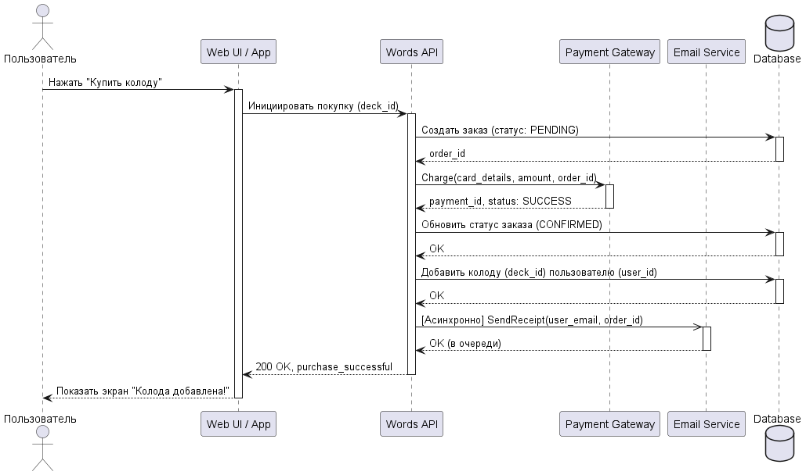
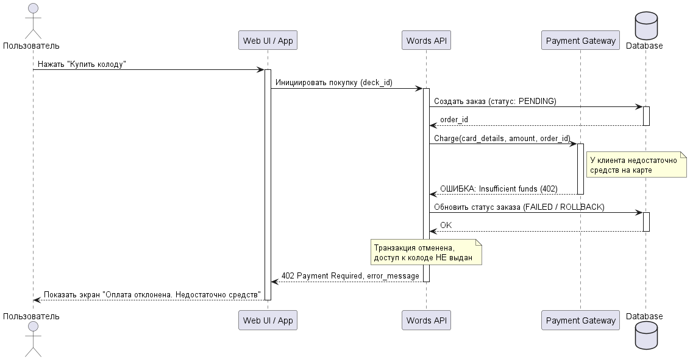

<p align="center">Министерство образования Республики Беларусь</p>
<p align="center">Учреждение образования</p>
<p align="center">"Брестский Государственный технический университет"</p>
<p align="center">Кафедра ИИТ</p>
<br><br><br><br><br><br>
<p align="center"><strong>Лабораторная работа №1</strong></p>
<p align="center"><strong>По дисциплине:</strong> "Проектирование интернет-систем"</p>
<p align="center"><strong>Тема:</strong> "Сценарий транзакции: моделирование use-case и границ ответственности"</p>
<br><br><br><br><br><br>
<p align="right"><strong>Выполнил:</strong></p>
<p align="right">Студент 3 курса</p>
<p align="right">Группа ПО-12</p>
<p align="right">Середич К.Н.</p>
<p align="right"><strong>Проверил:</strong></p>
<p align="right">Несюк А.Н.</p>
<br><br><br><br><br>
<p align="center"><strong>Брест 2026</strong></p>

---

## Цель работы

Научиться анализировать бизнес-процессы интернет-системы, выявлять границы ответственности компонентов и моделировать транзакционные сценарии с учётом возможных сбоев.

---

## Вариант №28 — «Говорю красиво» 🗣️

**Питч:** приложение для интервального повторения карточек и расширения словарного запаса (покупка колод, обучение).

**Ядро домена (фрагмент сценария):** пользователь, премиум-колода карточек, платёж, библиотека колод, e-mail чек.

---

## Ход выполнения работы

### 1. Структура проекта

```
lab-01/
├── Отчет.md
├── use-case.md
├── analysis.md
├── scenarios.feature
└── diagrams/
    ├── sequence-happy.puml
    └── sequence-error-payment.puml
```

---

### 2. Use-case описание

👉 **Ссылка на файл:** [use-case.md](use-case.md)

**Основной сценарий:** покупка и активация премиум-колоды карточек.

**Первичный актор:** пользователь (ученик).

**Цель:** оплатить и получить доступ к платной колоде.

**Краткое описание основного потока:**

1. Пользователь нажимает «Купить» у премиум-колоды.
2. Система инициирует оплату через Payment Gateway.
3. Пользователь подтверждает оплату.
4. Платёж подтверждён.
5. Статус транзакции — успех.
6. Колода добавляется в библиотеку пользователя.
7. Асинхронно ставится отправка чека (Email Service).
8. Пользователь видит сообщение об успешной покупке.

**Альтернативные и исключительные потоки:** отклонение карты; недоступность почтового сервиса с постановкой в очередь (eventual consistency). Подробно — в [use-case.md](use-case.md).

---

### 3. Диаграммы последовательности (Sequence Diagrams)

#### 3.1. Happy Path

👉 **PlantUML:** [diagrams/sequence-happy.puml](diagrams/sequence-happy.puml)



**Участники:** пользователь, система, Payment Gateway, БД, Email Service / очередь.

#### 3.2. Error Case

👉 **PlantUML:** [diagrams/sequence-error-payment.puml](diagrams/sequence-error-payment.puml)



**Описание:** отказ оплаты или таймаут шлюза → отмена транзакции / сценарии восстановления согласно [use-case.md](use-case.md).

---

### 4. Gherkin-сценарии

👉 **Ссылка на файл:** [scenarios.feature](scenarios.feature)

**Реализовано сценarioв:** не менее четырёх логических веток (успех, ошибка оплаты, деградация почты и т.д.) — см. файл.

**Пример (фрагмент):**

```gherkin
Scenario: Успешная покупка и активация колоды (Happy Path)
  When пользователь нажимает кнопку "Купить" для колоды "Business English"
  Then система добавляет колоду в библиотеку пользователя
```

---

### 5. Анализ границ ответственности

👉 **Ссылка на файл:** [analysis.md](analysis.md)

#### 5.1. Транзакционные границы

| Операция | Синхронная/Асинхронная | Откат при ошибке | Retry-стратегия | Идемпотентность |
|----------|------------------------|------------------|-----------------|-----------------|
| Создание заказа (PENDING) | Синхронная | Да | — | Да (idempotency key) |
| Списание (Payment Gateway) | Синхронная | Транзакция прерывается | Повтор ввода пользователем | Да (order_id) |
| Выдача доступа к колоде в БД | Синхронная | Да при критическом сбое | — | Да |
| Отправка чека | Асинхронная | Не влияет на покупку | Backoff, несколько попыток | Да (дедупликация) |

#### 5.2. Обработка исключительных ситуаций

**Исключительная ситуация: ошибка платежного шлюза**

- **Условие:** ошибка HTTP или таймаут ответа.
- **Обнаружение:** статус 4xx/5xx или `TimeoutException`.
- **Реакция:** заказ `FAILED`, при таймауте — фоновая проверка статуса платежа.
- **Компенсация:** доступ не выдан; при фактическом списании — refund.
- **Уведомление:** сообщение пользователю о невозможности завершить оплату.

---

## Таблица критериев оценки

| Критерий | Баллы | Выполнено |
|----------|-------|-----------|
| Use-case описание (акторы, потоки, исключения) | 15 | ✅ |
| Sequence diagram (happy path) | 20 | ✅ |
| Sequence diagram (error case) | 15 | ✅ |
| Gherkin: минимум 4 сценария | 20 | ✅ |
| Анализ транзакционных границ | 15 | ✅ |
| Обработка исключений (retry, компенсации) | 10 | ✅ |
| Качество документации | 5 | ✅ |
| **ИТОГО** | **100** | |

---

## Контрольные вопросы

1. **Что такое транзакционная граница?** Граница, внутри которой набор операций рассматривается как единое целое с точки зрения согласованности и отката; в сценарии покупки ею задаётся блок «оплата + запись в БД + побочные эффекты».
2. **Почему одни операции синхронные, другие асинхронные?** Критичный для успеха покупки путь (платёж, запись доступа) делается синхронно; доставка чека допускает отложенную обработку без блокировки пользователя.
3. **Как обеспечить идемпотентность?** Ключи идемпотентности на стороне платежа и при постановке задач в очередь, дедупликация по `order_id`.
4. **Что если внешний сервис ошибся после частичного выполнения?** Фиксация состояния заказа, компенсация или согласование через фоновые проверки и возвраты; недопустимо «молча» выдать продукт без подтверждённой оплаты.
5. **Как обнаружить недоступность сервиса?** Таймауты, health-check, коды ответа, мониторинг и алёрты.
6. **Что логировать?** Идентификаторы заказа и платежа, статусы переходов, корреляционные ID, ошибки шлюза и ретраи.

---

## Ссылка на репозиторий

👉 **GitHub:** https://github.com/HeG0k/PIS-2026

---

## Вывод

Спроектирован процесс покупки премиум-колоды: выявлены акторы и внешние системы, описаны happy path и отказы, оформлены Gherkin-сценарии и анализ границ (синхронность, откат, retry, eventual consistency для почты). Освоены моделирование последовательностей и описание транзакционных сценариев для интернет-системы.

---

**Дата выполнения:** ____________________

**Оценка:** _____________

**Подпись преподавателя:** _____________
