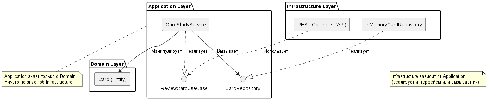

<p align="center">Министерство образования Республики Беларусь</p>
<p align="center">Учреждение образования</p>
<p align="center">"Брестский Государственный технический университет"</p>
<p align="center">Кафедра ИИТ</p>
<br><br><br><br><br><br>
<p align="center"><strong>Лабораторная работа №2</strong></p>
<p align="center"><strong>По дисциплине:</strong> "Проектирование интернет-систем"</p>
<p align="center"><strong>Тема:</strong> "Гексагональная архитектура: проектирование портов и адаптеров"</p>
<br><br><br><br><br><br>
<p align="right"><strong>Выполнил:</strong></p>
<p align="right">Студент 3 курса</p>
<p align="right">Группа ПО-12</p>
<p align="right">Середич К.Н.</p>
<p align="right"><strong>Проверил:</strong></p>
<p align="right">Несюк А.Н.</p>
<br><br><br><br><br>
<p align="center"><strong>Брест 2026</strong></p>

---

## Цель работы

Спроектировать архитектуру основного сервиса системы с использованием гексагональной (hexagonal) архитектуры: структура проекта, порты (интерфейсы), изоляция слоёв.

---

## Вариант №28 — «Говорю красиво» 🗣️

**Питч:** приложение интервального повторения карточек.

**Ядро домена (фрагмент):** карточка, сеанс проверки знаний, интервалы повторений.

**Выбранный сервис:** **Study Service** — проверка ответа пользователя и пересчёт интервала следующего показа карточки.

---

## Ход выполнения работы

### Часть 1. Архитектурная диаграмма

**Описание сервиса:** Study Service принимает результат повторения карточки, обновляет доменную модель (`record_review`) и сохраняет состояние через абстракцию хранилища.

**Диаграмма слоёв:** исходник PlantUML — [Architecture.puml](Architecture.puml).



**Направление зависимостей:** `infrastructure` → `application` → `domain` (домен не зависит от внешних слоёв).

---

### Часть 2. Структура проекта (скелет)

**Технология:** Python 3.

**Структура папок (фактическая):**

```
lab-02/
├── Отчет.md
├── Architecture.puml
└── src/study_service/
    ├── domain/models/card.py
    ├── application/
    │   ├── port/in_bound/review_card_use_case.py
    │   ├── port/out_bound/card_repository.py
    │   └── service/card_study_service.py
    └── infrastructure/
        ├── adapter/in_bound/api_controller.py
        ├── adapter/out_bound/in_memory_card_repository.py
        └── config/dependency_injection.py
```

---

### Часть 3. Domain Layer

**Ключевая сущность:** `Card` — метод `record_review` инкапсулирует пересчёт интервала без зависимостей от БД и HTTP.

---

### Часть 4. Application Layer (порты)

**Входящий порт:** `ReviewCardUseCase` — контракт сценария проверки карточки.

**Исходящий порт:** `CardRepository` — `get_by_id`, `save`.

**Сервис:** `CardStudyService` — оркестрация: загрузка карточки, вызов домена, сохранение.

---

### Часть 5. Infrastructure Layer

**Входящий адаптер:** `api_controller.py` — точка входа HTTP (FastAPI/аналог по курсу).

**Исходящий адаптер:** `InMemoryCardRepository` — хранение в памяти для демонстрации.

---

### Часть 6. Dependency Injection

**Файл:** [src/study_service/infrastructure/config/dependency_injection.py](src/study_service/infrastructure/config/dependency_injection.py)

Контейнер `DependencyContainer` связывает `CardStudyService` с реализацией `CardRepository` (принцип инверсии зависимостей).

---

## Описание портов и адаптеров

| Тип | Название | Назначение |
|-----|----------|------------|
| Входящий порт | `ReviewCardUseCase` | Сценарий проверки карточки |
| Исходящий порт | `CardRepository` | Абстракция хранения карточек |
| Входящий адаптер | API controller | HTTP API |
| Исходящий адаптер | `InMemoryCardRepository` | Реализация в памяти |

---

## Критерии выполнения

| Критерий | Выполнено | Комментарий |
|----------|-----------|-------------|
| Структура domain / application / infrastructure | ✅ | `src/study_service/` |
| Чистый Domain | ✅ | логика в `Card` |
| Порты in/out | ✅ | `abc`-интерфейсы |
| Адаптеры (вход + выход) | ✅ | API + in-memory repo |
| DI | ✅ | `dependency_injection.py` |
| Юнит-тесты (по макету) | ❌ | ... |
| Документация | ✅ | отчёт + PlantUML |

---

## Бонусные задания

| Бонус | Выполнено | Комментарий |
|-------|-----------|-------------|
| Реальная БД | ❌ | _по желанию_ |
| EventBus | ❌ | _по желанию_ |

---

## Выводы

Бизнес-логика изолирована в домене; прикладной слой зависит от портов, инфраструктура подменяема. Замена in-memory на PostgreSQL сводится к новой реализации `CardRepository` и правке контейнера DI без изменения домена и сценария приложения.

---

## Ссылка на репозиторий

👉 **GitHub:** https://github.com/HeG0k/PIS-2026

---

**Дата сдачи:** ____________________

**Подпись студента:** Середич К.Н.
