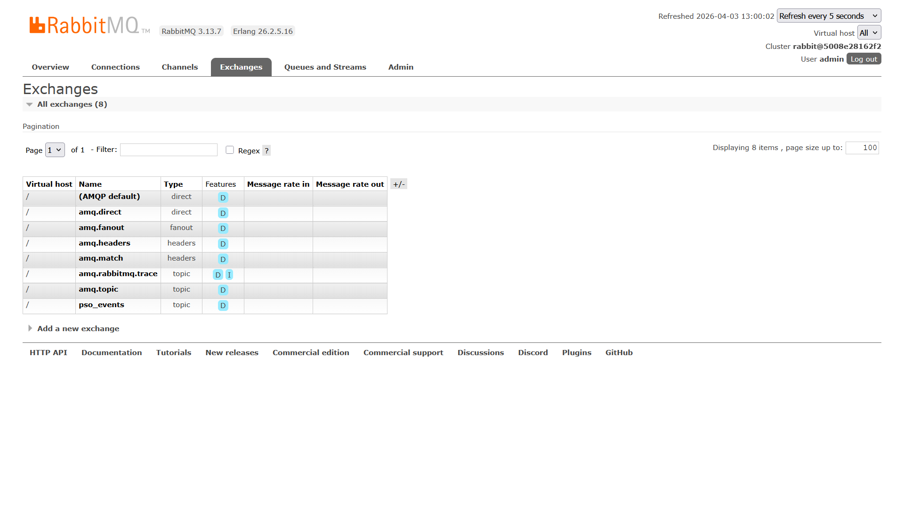
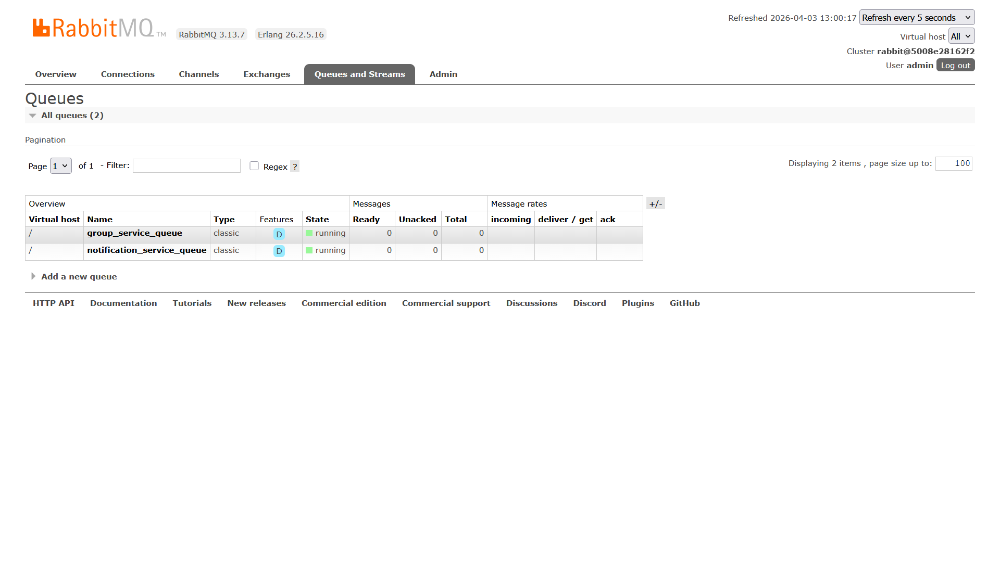

Министерство образования Республики Беларусь

Учреждение образования

"Брестский Государственный технический университет"

Кафедра ИИТ

      

<strong>Лабораторная работа №8</strong>

<strong>По дисциплине:</strong> "Проектирование интернет-систем"

<strong>Тема:</strong> "Микросервисы и Event Bus"

      

<strong>Выполнил:</strong>

Студент 3 курса

Группа ПО-12

Середич К.Н.

<strong>Проверил:</strong>

Несюк А.Н.

     

<strong>Брест 2026</strong>

---

## Цель работы

Разделить систему на **микросервисы** с **асинхронной коммуникацией** (Event Bus), изолированными БД и точкой входа **API Gateway**.

---

## Вариант №28 — «Говорю красиво» 🗣️

В рамках лабораторной реализован учебный контур **ПСО «Юго-Запад»** (заявки, группы, уведомления) по методическим материалам курса.

---

## Ход выполнения работы

### 1. Request Service

**Bounded context:** управление заявками (создание, назначение группы, активация).

**API (фрагмент):**

- `POST /requests` — создание;
- `GET /requests/{id}` — чтение;
- `PUT /requests/{id}/assign-group` — назначение готовой группы (HTTP к Group Service с **Circuit Breaker**);
- `PUT /requests/{id}/activate` — активация.

**БД:** отдельный экземпляр PostgreSQL (`requests-db`). Публикация событий в RabbitMQ — [services/request_service/infrastructure/event_bus/rabbitmq_publisher.py](services/request_service/infrastructure/event_bus/rabbitmq_publisher.py).

---

### 2. Group Service

**Bounded context:** группы волонтёров, участники, готовность (3–5 человек), перевод в `BUSY` при назначении.

**API (фрагмент):** `POST/GET/PUT/DELETE` для групп и участников, `mark-ready`, `mark-busy`.

**БД:** `groups-db`. Подписка на **`RequestCreated`** — [services/group_service/infrastructure/event_bus/rabbitmq_subscriber.py](services/group_service/infrastructure/event_bus/rabbitmq_subscriber.py).

---

### 3. Notification Service

Подписка на события **`GroupAssignedToRequest`** и **`RequestActivated`**; доставка уведомления моделируется выводом в лог (асинхронно из шины).

---

### 4. Event Bus (RabbitMQ)

**Exchange:** `pso_events`, тип **topic** (общие параметры — [event_bus/rabbitmq_config.py](event_bus/rabbitmq_config.py)).

**Сериализация сообщений:** `event_id`, `event_type`, `occurred_at`, `payload`.

**Скриншот RabbitMQ Management (Exchanges):**

**Скриншот RabbitMQ Management (Queues):**

---

### 5. API Gateway (Nginx)

**Маршрутизация:**

- `/requests` → Request Service;
- `/groups` → Group Service;
- `/health` — проверка шлюза.

Конфигурация: [nginx.conf](nginx.conf) (в корне `lab-08`). Для Docker добавлены `resolver` и `proxy_pass` с переменной; CORS и rate limiting — по методичке; для `OPTIONS` используется `return 204` при заголовках CORS на уровне `server` с `always`.

---

### 6. Circuit Breaker и отказоустойчивость

Клиент к Group Service: `pybreaker`, `fail_max=5`, **`reset_timeout=60`** (актуально для ветки 1.x библиотеки), fallback `_get_cached_group` → `None`. Файл: [services/request_service/infrastructure/http/circuit_breaker.py](services/request_service/infrastructure/http/circuit_breaker.py).

---

### 7. Docker Compose

[docker-compose.yml](docker-compose.yml) — сервисы приложений, две БД, RabbitMQ, notification-service, api-gateway.

---

## Таблица критериев оценки

| Критерий | Баллы | Выполнено |
|----------|-------|-----------|
| Request Service (bounded context + своя БД) | 20 | ✅ |
| Group Service (CRUD / REST) | 15 | ✅ |
| Event Bus (RabbitMQ) | 25 | ✅ |
| API Gateway | 15 | ✅ |
| Circuit Breaker | 15 | ✅ |
| Docker Compose | 5 | ✅ |
| Качество документации (в т.ч. C4) | 5 | ✅ |
| **ИТОГО** | **100** | |

---

## Контрольные вопросы

1. **Bounded context:** смысловая граница модели с согласованным языком и явными контрактами между контекстами (HTTP, события).
2. **Почему не общая БД:** связность, совместные релизы и миграции; нарушение автономности сервисов.
3. **Распределённые транзакции:** нет «одной» ACID-транзакции между сервисами без тяжёлых протоколов; нужны саги и согласие с eventual consistency.
4. **Circuit Breaker:** ограничение каскадных отказов и разгрузка деградирующего downstream.

---

## Диаграмма уровня контейнеров (C4, кратко)

Клиент → **API Gateway (Nginx)** → **Request Service** / **Group Service**; **Request Service**, **Group Service** и **Notification Service** → **RabbitMQ**; **Request Service** → **PostgreSQL (requests)**; **Group Service** → **PostgreSQL (groups)**.

---

## Ссылка на репозиторий

👉 **GitHub:** https://github.com/HeG0k/PIS-2026

---

## Вывод

Система разбита на сервисы с отдельными БД; синхронные вызовы защищены circuit breaker, асинхронные уведомления идут через RabbitMQ; единая точка входа — Nginx. Освоены паттерны Event Bus и database per service.

---

**Дата выполнения:** ____________________

**Оценка:** _____________

**Подпись преподавателя:** _____________
